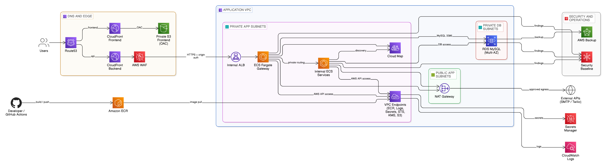
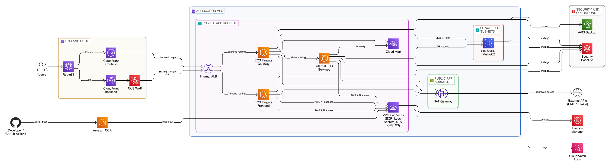

# AWS-ECS-Blueprint

An AWS Terraform blueprint for private web workloads on ECS Fargate, with CloudFront and WAF at the edge, an internal ALB, private RDS, VPC endpoints, controlled outbound egress, backups, and production-oriented CI/CD.

### Architecture

Default frontend `s3` mode:

[](./img/aws-ecs-blueprint-architecture.png)

Frontend `ecs` mode:

[](./img/aws-ecs-blueprint-architecture-frontend-ecs.png)

The backend side stays the same across both diagrams. The frontend side changes from `Route53 -> CloudFront (frontend) -> private S3 (OAC)` in `s3` mode to `Route53 -> CloudFront (frontend) -> internal ALB/ECS frontend` in `ecs` mode.

## Table of Contents

- [Prerequisites](#prerequisites)
- [Installation](#installation)
- [Usage](#usage)
- [Runtime Modes](#runtime-modes)
- [Frontend Delivery Modes](#frontend-delivery-modes)
- [Architecture and Networking](#architecture-and-networking)
- [Terraform Configuration](#terraform-configuration)
- [Repository Layout](#repository-layout)
- [Make Targets](#make-targets)
- [CI/CD and GitHub Actions](#cicd-and-github-actions)
- [License](#license)

## Prerequisites

- Terraform CLI
- An AWS account and IAM permissions or assumed role for the target deployment root
- An S3 bucket for Terraform remote state
- ACM certificates for CloudFront and the regional ALB if using custom domains
- Route53 hosted zone access if you want Terraform-managed DNS
- ECR images published by digest for the services you deploy
- Runtime secrets stored in AWS Secrets Manager

## Installation

```bash
git clone https://github.com/firassBenNacib/AWS-ECS-Blueprint.git
cd AWS-ECS-Blueprint
cp prod-app/backend.hcl.example prod-app/backend.hcl
cp prod-app/terraform.microservices.tfvars.example prod-app/terraform.tfvars
```

Update `prod-app/backend.hcl` and `prod-app/terraform.tfvars` with real values before planning or applying. Use the `nonprod-app/` root the same way for a second environment.

## Usage

The primary public path is single-account deployment using the `prod-app` and `nonprod-app` roots.

1. Initialize the chosen deployment root:

```bash
terraform -chdir=prod-app init -reconfigure -backend-config=backend.hcl
```

2. Review the plan:

```bash
terraform -chdir=prod-app plan -var-file=terraform.tfvars
```

3. Apply the deployment:

```bash
terraform -chdir=prod-app apply -var-file=terraform.tfvars
```

Use the same flow for `nonprod-app`.

## Runtime Modes

- `single_backend`: one ECS Fargate service behind the internal ALB
- `gateway_microservices`: one gateway ECS Fargate service behind the ALB plus private internal ECS services registered in Cloud Map

The checked-in `prod-app` and `nonprod-app` examples currently use `gateway_microservices`.

## Frontend Delivery Modes

- Default path: `frontend_runtime_mode = "s3"` keeps the frontend on a private S3 origin behind CloudFront with OAC.
- Alternate path: `frontend_runtime_mode = "ecs"` switches the frontend CloudFront origin to the ALB/ECS path.
- `ecs` frontend mode now avoids provisioning the frontend content buckets, frontend bucket policies, and frontend replication path.
- Platform S3 usage still exists for logs and state where configured; the ECS-only change applies to frontend content delivery resources.

## Architecture and Networking

- Runtime is ECS on Fargate.
- Users reach the deployment through Route53 and two CloudFront distributions.
- By default, the frontend CloudFront distribution serves a private S3 frontend origin through OAC.
- When `frontend_runtime_mode = "ecs"`, the frontend CloudFront distribution uses the ALB/ECS frontend origin instead of frontend content buckets.
- The backend CloudFront distribution reaches the application through AWS WAF and an internal ALB.
- ECS tasks run in private app subnets with no public IPs.
- AWS API access stays private through interface VPC endpoints for ECR, CloudWatch Logs, Secrets Manager, STS, and KMS, plus an S3 gateway endpoint.
- External SMTP and HTTPS integrations use controlled outbound egress through NAT rather than endpoint-only zero-egress networking.
- RDS MySQL runs Multi-AZ in private DB subnets.
- In single-account mode, `prod-app` owns the account-level security controls and `nonprod-app` stays workload-only plus per-root backup ownership.

## Terraform Configuration

Use the checked-in example files as templates:

- [`prod-app/backend.hcl.example`](./prod-app/backend.hcl.example)
- [`prod-app/terraform.tfvars.example`](./prod-app/terraform.tfvars.example)
- [`prod-app/terraform.microservices.tfvars.example`](./prod-app/terraform.microservices.tfvars.example)
- [`nonprod-app/backend.hcl.example`](./nonprod-app/backend.hcl.example)
- [`nonprod-app/terraform.tfvars.example`](./nonprod-app/terraform.tfvars.example)
- [`nonprod-app/terraform.microservices.tfvars.example`](./nonprod-app/terraform.microservices.tfvars.example)

The minimum real values you typically need to replace are:

- backend bucket and unique state key
- `project_name`
- VPC CIDRs and availability zones
- domain and certificate ARNs
- image digests for deployed services
- Secrets Manager ARNs and runtime secret references

## Repository Layout

The main public operator path is:

- [`modules/`](./modules): reusable Terraform modules
- [`prod-app/`](./prod-app): production deployment root
- [`nonprod-app/`](./nonprod-app): non-production deployment root
- [`docs/`](./docs): architecture, runbooks, CI/CD, and operational notes
- [`.github/`](./.github): repository policy and CI/CD workflow definitions
- [`img/`](./img): architecture assets used in the README

## Make Targets

The public operator interface for local checks is the [Makefile](./Makefile).

Common targets:

- `make fmt`: format Terraform recursively
- `make fmt-check`: check Terraform formatting
- `make validate`: validate deployable roots and reusable modules
- `make validate-targets`: validate Terraform deployment roots
- `make validate-modules`: validate reusable modules
- `make docs-check`: check module documentation drift
- `make scan-targets`: run local Terraform security scans
- `make check-backend-keys`: verify backend state key separation
- `make clean-local`: remove generated local caches and reports
- `make safe-destroy-root ROOT=prod-app`: guarded destroy flow for an app root

## CI/CD and GitHub Actions

The repository uses a focused workflow set under [`.github/workflows/`](./.github/workflows):

- `ci-terraform.yml`: Terraform formatting, validation, linting, and security scanning
- `dependency-review.yml`: dependency and supply-chain review on pull requests
- `pr-plan.yml`: speculative Terraform plans for pull requests
- `deploy.yml`: saved-plan deployment flow with GitHub environment approval
- `destroy.yml`: manual destroy flow with typed confirmation and GitHub environment approval
- `live-validation.yml`: scheduled or manual apply/smoke/destroy validation runs
- `terraform-docs.yml`: module documentation drift checks
- `allowlist-expiry.yml`: allowlist governance checks
- `actionlint.yml`: workflow and composite action linting

Repository variables used by the plan and deploy path:

- `TF_BACKEND_BUCKET`
- `TF_BACKEND_REGION`

Secrets used by the GitHub OIDC deployment path:

- `AWS_ROLE_ARN_PROD_APP`
- `AWS_ROLE_ARN_NONPROD_APP`
- `TFVARS_PROD_APP`
- `TFVARS_NONPROD_APP`

Live validation also uses per-root tfvars secrets, documented in [`docs/ci-cd.md`](./docs/ci-cd.md).

Protected GitHub environments should exist for:

- `prod-app`
- `nonprod-app`
- `prod-app-destroy`
- `nonprod-app-destroy`

## License

This project is licensed under the [MIT License](./LICENSE).

## Author

Created and maintained by Firas Ben Nacib - [bennacibfiras@gmail.com](mailto:bennacibfiras@gmail.com)
