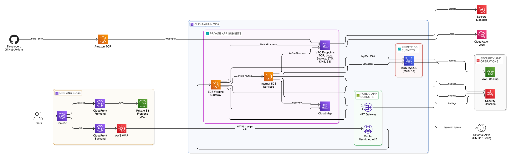

# AWS-ECS-Blueprint

An AWS Terraform blueprint for supported private web workloads on ECS Fargate, with CloudFront and WAF at the edge, an internal or CloudFront-restricted ALB, private RDS, VPC endpoints, controlled outbound egress, backups, and production-oriented CI/CD.

### Architecture

Default frontend `s3` mode:

[](./img/aws-ecs-blueprint-architecture.png)

Frontend `ecs` mode:

[](./img/aws-ecs-blueprint-architecture-frontend-ecs.png)

Backend `public_alb_restricted` mode:

[](./img/aws-ecs-blueprint-architecture-public-alb-restricted.png)

The backend side stays the same across both diagrams. The frontend side changes from `Route53 -> CloudFront (frontend) -> private S3 (OAC)` in `s3` mode to `Route53 -> CloudFront (frontend) -> internal ALB/ECS frontend` in `ecs` mode.
The alternate backend ingress mode `public_alb_restricted` keeps the frontend on private S3 with OAC, but switches the backend/API path to a public ALB restricted to CloudFront origin-facing infrastructure.

## Table of Contents

- [Prerequisites](#prerequisites)
- [Installation](#installation)
- [Usage](#usage)
- [Runtime Modes](#runtime-modes)
- [Backend Ingress Modes](#backend-ingress-modes)
- [Support Model](#support-model)
- [Frontend Delivery Modes](#frontend-delivery-modes)
- [Multi-Account Operating Model](#multi-account-operating-model)
- [Domain And Front-Door Strategy](#domain-and-front-door-strategy)
- [Architecture and Networking](#architecture-and-networking)
- [Terraform Configuration](#terraform-configuration)
- [Repository Layout](#repository-layout)
- [Make Targets](#make-targets)
- [CI/CD and GitHub Actions](#cicd-and-github-actions)
- [License](#license)
- [Author](#author)

## Prerequisites

- Terraform CLI
- An AWS account and IAM permissions or assumed role for the target deployment root
- An S3 bucket for Terraform remote state
- ACM certificates for CloudFront and the regional ALB if using custom domains
- Route53 hosted zone access if you want Terraform-managed DNS
- ECR images published by digest for the services you deploy
- Runtime secrets stored in AWS Secrets Manager

## Installation

```bash
git clone https://github.com/firassBenNacib/AWS-ECS-Blueprint.git
cd AWS-ECS-Blueprint
cp prod-app/backend.hcl.example prod-app/backend.hcl
cp prod-app/terraform.microservices.tfvars.example prod-app/terraform.tfvars
```

Update `prod-app/backend.hcl` and `prod-app/terraform.tfvars` with real values before planning or applying. Use the `nonprod-app/` root the same way for a second environment.

## Usage

The primary public path is single-account deployment using the `prod-app` and `nonprod-app` roots.

1. Initialize the chosen deployment root:

```bash
terraform -chdir=prod-app init -reconfigure -backend-config=backend.hcl
```

2. Review the plan:

```bash
terraform -chdir=prod-app plan -var-file=terraform.tfvars
```

3. Apply the deployment:

```bash
terraform -chdir=prod-app apply -var-file=terraform.tfvars
```

Use the same flow for `nonprod-app`.

## Runtime Modes

- `single_backend`: one ECS Fargate service behind the internal ALB
- `gateway_microservices`: one gateway ECS Fargate service behind the ALB plus private internal ECS services registered in Cloud Map

The checked-in `prod-app` and `nonprod-app` examples currently use `gateway_microservices`.

## Backend Ingress Modes

- Default path: `backend_ingress_mode = "vpc_origin_alb"` keeps the backend ALB private and reachable only through a CloudFront VPC origin.
- Alternate path: `backend_ingress_mode = "public_alb_restricted"` places the backend ALB in public edge subnets but restricts ALB ingress to CloudFront origin-facing infrastructure only.
- Use `public_alb_restricted` when a workload needs protocol or feature support that CloudFront VPC origins do not provide, while still keeping CloudFront and WAF in front of the application.

## Support Model

- This repository should be described as production-ready for supported workloads, not as a guaranteed drop-in for every workload.
- The default supported workload class is HTTP/HTTPS ECS web applications that fit behind CloudFront and ALB request/response semantics.
- `backend_ingress_mode = "vpc_origin_alb"` is the preferred default for private-origin workloads that fit current CloudFront VPC-origin capabilities.
- `backend_ingress_mode = "public_alb_restricted"` is the alternate mode for workloads that still fit CloudFront plus ALB, but need a public-restricted ALB instead of a private VPC origin.
- For WebSockets, gRPC, or other advanced origin features, verify AWS support for your specific use case before choosing `vpc_origin_alb`.
- If your workload needs a different ingress pattern, use this repository as a starting point and adapt the design accordingly.

## Frontend Delivery Modes

- Default path: `frontend_runtime_mode = "s3"` keeps the frontend on a private S3 origin behind CloudFront with OAC.
- Alternate path: `frontend_runtime_mode = "ecs"` switches the frontend CloudFront origin to the ALB/ECS path.
- `ecs` frontend mode now avoids provisioning the frontend content buckets, frontend bucket policies, and frontend replication path.
- Platform S3 usage still exists for logs and state where configured; the ECS-only change applies to frontend content delivery resources.

## Multi-Account Operating Model

- The recommended production posture is `prod-app` in a dedicated production AWS account and `nonprod-app` in a separate non-production AWS account.
- The roots already support that split through distinct CI target wiring, backend keys, deploy environments, and optional per-root `assume_role` inputs.
- A stricter organization model can add separate security and log-archive accounts while keeping this repository focused on the application runtime roots.
- In same-account mode, `prod-app` should remain the owner of the account-level security controls to avoid duplicate account-scope services.

## Domain And Front-Door Strategy

- Default root topology: one frontend CloudFront distribution is the main public front door, and backend/API paths are routed through ordered cache behaviors to the backend origin.
- Typical single-domain pattern: serve the site from the apex or `www` alias and forward backend paths such as `/api/*` through the same frontend distribution.
- Alternate pattern: use the reusable `modules/cloudfront_backend` module when you want a dedicated API subdomain and a separate backend distribution lifecycle.
- The checked-in `prod-app` and `nonprod-app` roots use the single front-door pattern by default; the dedicated backend distribution module remains available for consumers that need a separate API hostname.

## Architecture and Networking

- Runtime is ECS on Fargate.
- The checked-in roots use one frontend CloudFront distribution with ordered backend path behaviors routed to the ALB.
- A separate reusable `modules/cloudfront_backend` module exists for consumers that want a dedicated API distribution, but the default roots do not instantiate it.
- By default, the frontend CloudFront distribution serves a private S3 frontend origin through OAC.
- When `frontend_runtime_mode = "ecs"`, the frontend CloudFront distribution uses the ALB/ECS frontend origin instead of frontend content buckets.
- In the default ingress mode, backend/API paths reach the application through AWS WAF and an internal ALB exposed through a CloudFront VPC origin.
- In `public_alb_restricted` mode, backend/API paths still pass through CloudFront and WAF, but the ALB becomes internet-facing and is restricted to CloudFront origin-facing infrastructure.
- ECS tasks run in private app subnets with no public IPs.
- AWS API access stays private through interface VPC endpoints for ECR, CloudWatch Logs, Secrets Manager, STS, and KMS, plus an S3 gateway endpoint.
- External SMTP and HTTPS integrations use controlled outbound egress through NAT rather than endpoint-only zero-egress networking.
- RDS MySQL runs Multi-AZ in private DB subnets.
- `enable_cost_optimized_dev_tier = true` is the cheapest supported workload profile: it forces private-app NAT to `disabled`, turns the workload RDS instance into single-AZ, disables managed WAF and per-root AWS Backup, clamps ECS task counts to `1/1/1`, and disables the account-level security baseline controls for that root.
- Because the cheap-dev profile removes NAT, private-subnet services that call external SMTP/HTTPS providers will need either NAT re-enabled or a separate dev-only public-placement design before those integrations can work.
- Production still requires managed WAF or explicit web ACL ARNs. Non-production roots may disable WAF explicitly when you accept the lower protection level.
- The workload RDS master user secret is stored in Secrets Manager and can be rotated automatically through an AWS-hosted rotation Lambda managed by CloudFormation.
- Optional AWS Budgets alerts can publish monthly cost thresholds for total spend plus CloudFront, VPC/NAT, and RDS cost buckets.
- When `enable_ecs_exec = true` and `enable_ecs_exec_audit_alerts = true` in production, EventBridge forwards ECS Exec shell access events to the security findings SNS path.
- In single-account mode, `prod-app` owns the account-level security controls. The checked-in `nonprod-app` root now uses a practical low-cost profile with a single NAT gateway, single-AZ RDS, managed WAF disabled, per-root AWS Backup disabled, and account-level security controls disabled.
- Supported default workload class: HTTP/HTTPS web workloads on ECS behind CloudFront.
- The blueprint is intended to be production-ready for that supported workload class when the environment-specific DNS, certificate, IAM, secrets, and validation prerequisites are wired correctly.
- Important CloudFront VPC-origin limits: do not assume WebSockets, gRPC, or every custom origin feature is supported by the default `vpc_origin_alb` mode.
- For VPC origins, AWS creates and manages the `CloudFront-VPCOrigins-Service-SG`; treat that security group as service-managed and do not edit it manually.
- Main optional cost drivers are dual-region replication, dual-mode frontend delivery support, CloudFront/WAF, NAT egress, and the security baseline controls.

## Terraform Configuration

Use the checked-in example files as templates:

- [`prod-app/backend.hcl.example`](./prod-app/backend.hcl.example)
- [`prod-app/terraform.tfvars.example`](./prod-app/terraform.tfvars.example)
- [`prod-app/terraform.microservices.tfvars.example`](./prod-app/terraform.microservices.tfvars.example)
- [`prod-app/terraform.frontend-ecs.tfvars.example`](./prod-app/terraform.frontend-ecs.tfvars.example)
- [`prod-app/terraform.public-alb-restricted.tfvars.example`](./prod-app/terraform.public-alb-restricted.tfvars.example)
- [`nonprod-app/backend.hcl.example`](./nonprod-app/backend.hcl.example)
- [`nonprod-app/terraform.tfvars.example`](./nonprod-app/terraform.tfvars.example)
- [`nonprod-app/terraform.microservices.tfvars.example`](./nonprod-app/terraform.microservices.tfvars.example)
- [`nonprod-app/terraform.frontend-ecs.tfvars.example`](./nonprod-app/terraform.frontend-ecs.tfvars.example)
- [`nonprod-app/terraform.public-alb-restricted.tfvars.example`](./nonprod-app/terraform.public-alb-restricted.tfvars.example)

The curated example profiles are intended to cover:

- default workload roots
- gateway/microservices topology
- frontend `ecs` delivery mode
- backend `public_alb_restricted` ingress mode

The repository ships `nonprod-app/terraform.tfvars.example` as the public low-cost starting point. Create a real `terraform.tfvars` locally or inject it through CI secrets. The default example remains the ultra-cheap zero-NAT profile. It demonstrates the cheap dev toggle with endpoint-first private networking, single-AZ RDS, managed WAF disabled, per-root AWS Backup disabled, ECS counts clamped to `1/1/1`, and account-level security controls disabled.

If you want a low-cost profile that still keeps private services on a single NAT gateway for external SMTP/HTTPS integrations, prefer `private_app_nat_mode = "canary"` in your local or secret-managed tfvars.

The replaceable `__TOKEN__` placeholders used by the example tfvars files are documented in [`docs/deployment-roots.md`](./docs/deployment-roots.md#replaceable-tokens-in-example-tfvars).

The minimum real values you typically need to replace are:

- backend bucket and unique state key
- `project_name`
- VPC CIDRs and availability zones
- domain and certificate ARNs
- image digests for deployed services
- Secrets Manager ARNs and runtime secret references

For public DNS, prefer an explicit `route53_zone_id` in production-style deployments. Example profiles that leave `route53_zone_id = null` now also set `route53_zone_strategy = "create"` so DNS ownership is intentional instead of relying on automatic hosted-zone discovery.

## Repository Layout

The main public operator path is:

- [`modules/`](./modules): reusable Terraform modules
- [`prod-app/`](./prod-app): production deployment root
- [`nonprod-app/`](./nonprod-app): non-production deployment root
- [`docs/`](./docs): architecture, runbooks, CI/CD, and operational notes
- [`.github/`](./.github): repository policy and CI/CD workflow definitions
- [`img/`](./img): architecture assets used in the README

## Make Targets

The public operator interface for local checks is the [Makefile](./Makefile).

Common targets:

- `make fmt`: format Terraform recursively
- `make fmt-check`: check Terraform formatting
- `make init-root ROOT=prod-app`: initialize one deployment root
- `make init-roots`: initialize both deployment roots
- `make validate`: validate deployable roots and reusable modules
- `make validate-root ROOT=prod-app`: validate one Terraform deployment root
- `make validate-roots`: validate Terraform deployment roots
- `make validate-modules`: validate reusable modules
- `make check-root-parity`: verify that `prod-app` and `nonprod-app` keep the same `module "app"` input surface
- `make test-modules`: run native Terraform tests for reusable modules
- `make test-module MODULE=application_platform`: run native Terraform tests for one reusable module
- `make test-root ROOT=prod-app`: run native Terraform tests for one deployment root
- `make test-roots`: run native Terraform tests for `prod-app` and `nonprod-app`
- `make ci-root ROOT=prod-app`: run the main local quality gates for one deployment root
- `make ci-local`: run the main local quality gates in one command
- `make docs-check`: check module documentation drift
- `make scan-root ROOT=prod-app`: run local Terraform security scans for one deployment root
- `make scan-roots`: run local Terraform security scans for all deployment roots
- `make plan-root ROOT=prod-app`: run a locked local plan for one deployment root
- `make plan-roots`: run local plans for all deployment roots
- `make tag-plan-root ROOT=prod-app`: report tag coverage from a locked root plan
- `make tag-state-root ROOT=prod-app`: report tag coverage from a root state
- `make destroy-root ROOT=prod-app`: guarded destroy flow for one deployment root
- `make destroy-roots CONFIRM_ALL=true`: guarded destroy flow for all deployment roots
- `make check-backend-keys`: verify backend state key separation
- `make clean-local`: remove generated local caches and reports

## CI/CD and GitHub Actions

The repository uses a focused workflow set under [`.github/workflows/`](./.github/workflows):

- `ci-terraform.yml`: Terraform formatting, validation, linting, and security scanning
- `dependency-review.yml`: dependency and supply-chain review on pull requests
- `snyk.yml`: explicit Snyk open-source and Terraform IaC scanning
- `pr-plan.yml`: speculative Terraform plans for pull requests
- `drift-detection.yml`: weekly or on-demand plan-only drift detection against live backend state
- `deploy.yml`: saved-plan deployment flow with GitHub environment approval
- `destroy.yml`: manual destroy flow with typed confirmation and GitHub environment approval
- `live-validation.yml`: scheduled or manual apply/smoke/destroy validation runs
- `terratest-live-validation.yml`: scheduled or manual Go-based Terratest apply/smoke/destroy validation runs against the same live-validation helper scripts
- `terraform-docs.yml`: module documentation drift checks
- `allowlist-expiry.yml`: allowlist governance checks
- `actionlint.yml`: workflow and composite action linting

Repository variables required for the normal plan, deploy, and destroy path:

- `TF_BACKEND_BUCKET`
- `TF_BACKEND_REGION`

Repository secrets required for the normal GitHub OIDC plan, deploy, and destroy path:

- `AWS_ROLE_ARN_PROD_APP`
- `AWS_ROLE_ARN_NONPROD_APP`
- `TFVARS_PROD_APP`
- `TFVARS_NONPROD_APP`

Optional repository secrets:

- `INFRACOST_API_KEY` for pull request monthly-cost estimates in `pr-plan.yml`
- `SNYK_TOKEN` for explicit Snyk open-source and IaC scans
- `LIVE_VALIDATION_TFVARS_*` only when you intentionally enable live-validation workflows

The checked-in [`infracost.yml`](./infracost.yml) is kept for local `infracost breakdown` usage. The GitHub PR workflow intentionally uses speculative Terraform plan JSON plus repo-secret tfvars instead of that file so the PR cost comment tracks the actual target inputs more closely.

GitHub environment-scoped secrets and variables are optional in the current workflow design. The default workflow path reads the repo-level values above, while environments are still useful for approvals, isolation, and future stricter secret scoping.

Live validation also uses per-root tfvars secrets, documented in [`docs/ci-cd.md`](./docs/ci-cd.md). The repo now includes a dedicated [`live-validation-bootstrap`](./live-validation-bootstrap) root to provision validation-only ACM certificates and origin-auth SSM parameters before those secrets are enabled in GitHub. The operator checklist and troubleshooting path now live in [`docs/live-validation.md`](./docs/live-validation.md).

Current target intent:

- `prod-app`: manual live validation only, after validation-only DNS, ACM, and tfvars secrets are configured
- `nonprod-app`: manual and scheduled live validation once its validation-only environment is intentionally maintained
- live validation now forces an isolated `lv-*` environment name, uses a stable validation DNS label such as `lv-prod` / `lv-nonprod`, and verifies Route53 alias records, CloudFront deployment state, and ACM certificate coverage before smoke checks pass
- Trivy config is the primary CI config scanner; tfsec remains available as an opt-in compatibility gate when teams still want the legacy allowlist path.

Protected GitHub environments should exist for:

- `prod-app`
- `nonprod-app`
- `prod-app-destroy`
- `nonprod-app-destroy`

## License

This project is licensed under the [MIT License](./LICENSE).

## Author

Created and maintained by Firas Ben Nacib - [bennacibfiras@gmail.com](mailto:bennacibfiras@gmail.com)
